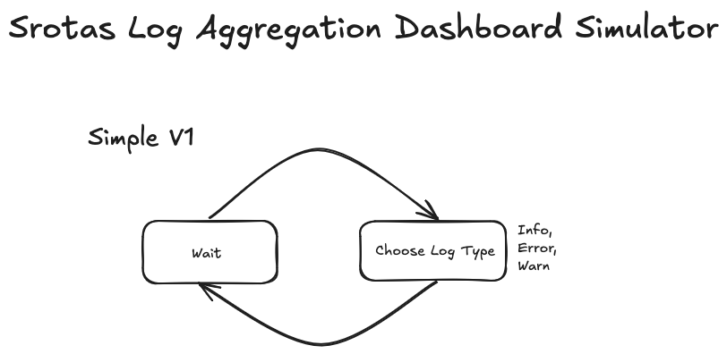

# Srotas-Log-Aggregation
Log Generator for Srotas

# Motivation
I wanted to make an app which will generate random logs which can be used by the Srotas project.
This is also an interesting point to explore other similar fields such as **Stochastic processes**, 
**Queueing theory**, **Discrete Event Simulation** and **Fuzzing**.

# Ideology
Minimal external depencendy. I wanna control all of my code.
Only Exception (Till Now): coder/websocket as Go LACKS a good standard implementation (Shocking!)

# Architecture

# Structured Logging works using API
